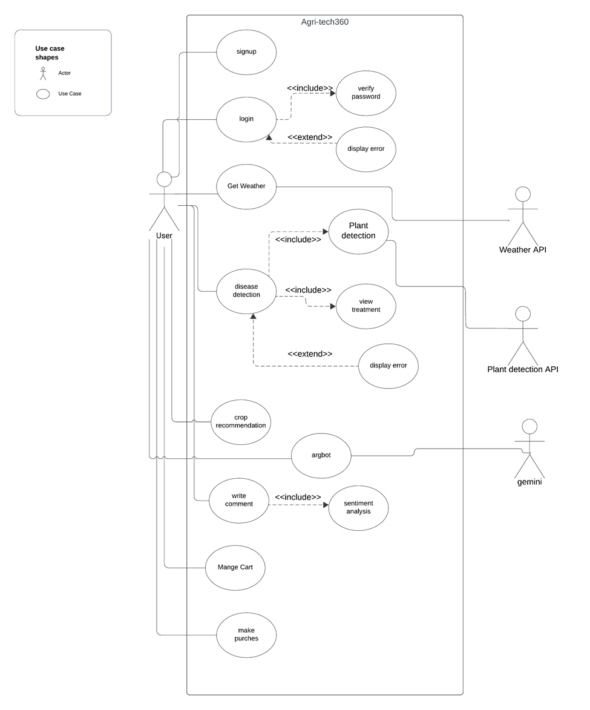

 

    
  
# 👋 Welcome! Agri-tech360 Project

<b>AI-Powered Plant Detection, Diagnosis, and Plant Recommender for Precision Farming
</b>

## Overview

Introducing Agri-tech 360: our user-friendly app and website revolutionizing agriculture. With an intuitive interface, it offers advanced features like plant disease detection with medication recommendations, a user-rated store, and sentiment analysis for product feedback. Predict soil Type for optimal crop selection, explore detailed plant information, and stay informed with real-time weather updates. Our AI chatbot provides instant support, empowering users with comprehensive agricultural tools for productivity and sustainability.

Agri-tech360 offers a comprehensive solution to address the challenges identified in the agricultural sector. The platform leverages innovative technologies and features to achieve its objectives and improve agricultural practices. Below are the key components of the proposed solution:

#### 1.	Advanced Plant Disease Detection and Management:

•	Agri-tech360 utilizes AI-driven computer vision technology to enable early detection and management of plant diseases.

•	Users can upload images of diseased plants for analysis, receive accurate diagnoses, and access recommendations for treatment and management.

#### 2.	Crop Recommendation and Soil prediction:

•	Agri-tech360 provides users with tools for Recommend crop suitability based on soil Type, season, and previous crop.

#### 3.	Comprehensive Plant Information Database

4.	User Feedback and Sentiment Analysis:

•	Agri-tech 360 facilitates user feedback through features such as ratings, comments, and reviews.

•	sentiment analysis is used to analyze user feedback and provide insights to administrators for product improvement and decision-making

#### 5.	Real-time Weather Updated:

•	Agri-tech 360 provides users with real-time weather updates to enhance their understanding of local weather conditions.

•	Emphasize features as current weather conditions, temperature forecasts, and precipitation alerts to help users stay informed about weather patterns in their area.

#### 6.	Intelligent Chatbot Support:

•	Agri-tech 360 offers users instant assistance through an AI-powered chatbot.

•	provide personalized guidance on plant care, disease management, and agricultural best practices.

Use case Diagram
